# Exercise 1: Create the Senior Admins group with the user account Joseph Price as its member.

*Using the Entra ID portal*

1. Create a user account for Joseph Price using joseph@el1mkproton.onmicrosoft.com as a Member and autogenerated password.

<figure>
  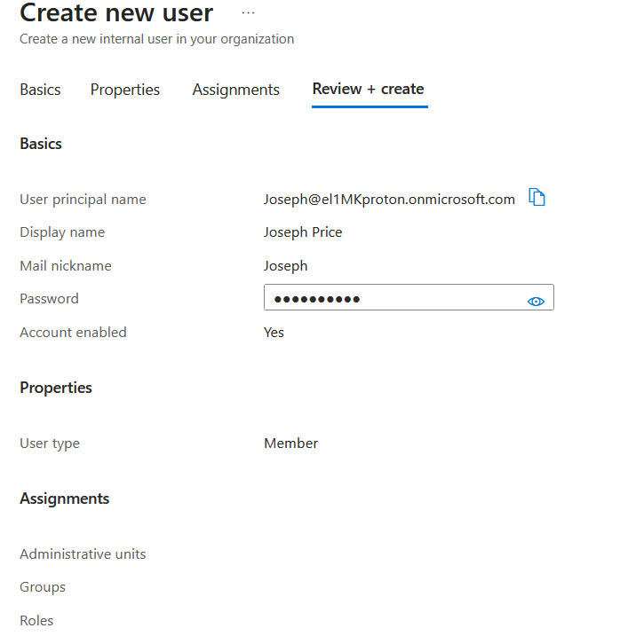
  </figcaption>
</figure>
<figure>
  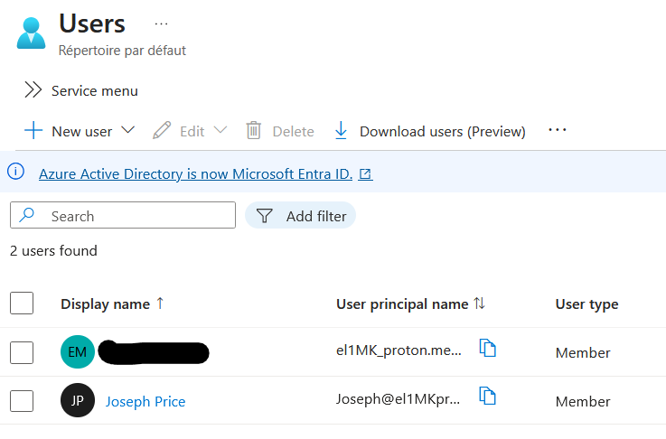
</figure>


2. Create Senior Admins group as a Security group with Assigned membership type.

<figure>
  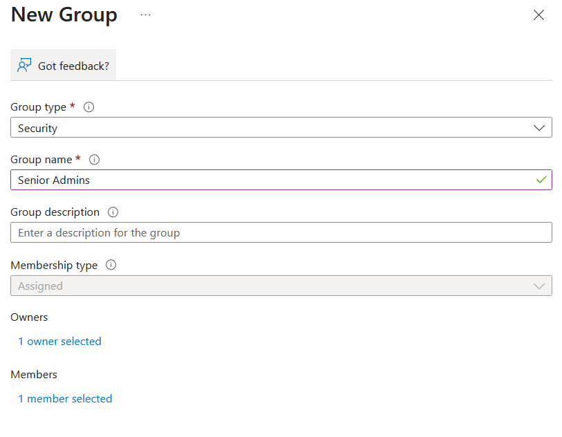
  </figcaption>
</figure>
<figure>
  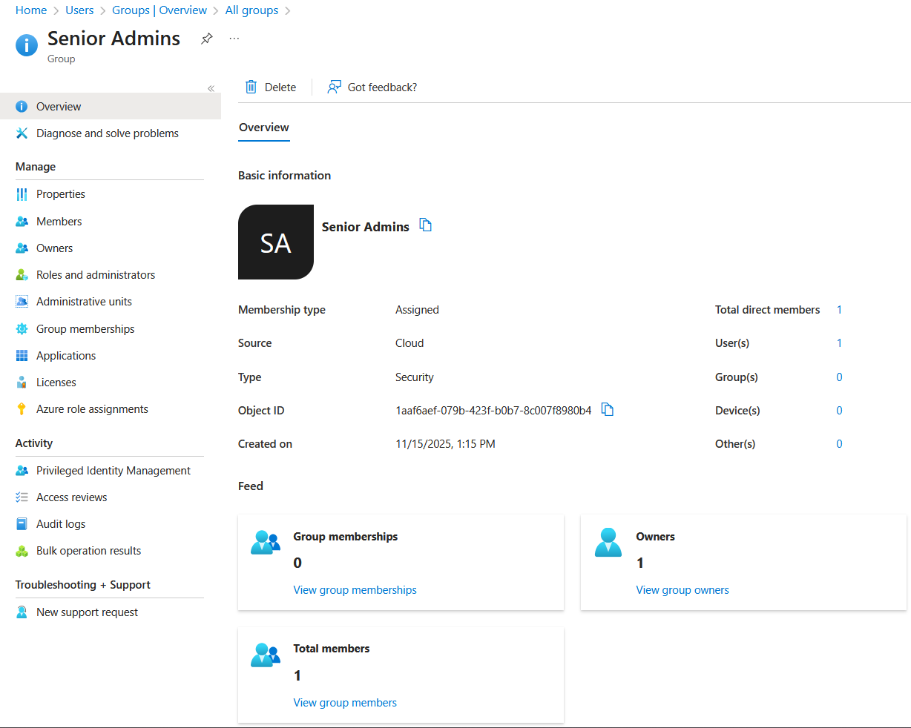
</figure>

# Exercise 2: Create a Junior Admins group containing the user account of Isabel Garcia as its member.

*Using Powershell*

1. Create a password profile object: ```$passwordProfile = New-Object -TypeName Microsoft.Open.AzureAD.Model.PasswordProfile```
2. Set the value of the password within the profile object: ```$passwordProfile.Password = "Pa55w.rd1234"```
3. Connect to Entra ID: ```Connect-AzureAD```
4. Identify the name of my Microsoft Entra tenant: ```$domainName = ((Get-AzureAdTenantDetail).VerifiedDomains)[0].Name```
5. Create a user account for Isabel Garcia using defined variables: ```New-AzureADUser -DisplayName 'Isabel Garcia' -PasswordProfile $passwordProfile -UserPrincipalName "Isabel@$domainName" -AccountEnabled $true -MailNickName 'Isabel'```
6. List Microsoft Entra ID users (the filter applied in the LAB instructions is not applicable in this context): ```Get-AzureADUser -All $true | Select-Object UserPrincipalName```
<figure>
  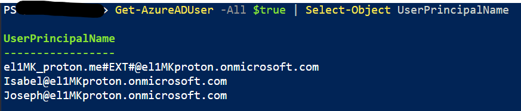
</figure>

7. Create a new security group named Junior Admins: ```New-AzureADGroup -DisplayName 'Junior Admins43846135' -MailEnabled $false -SecurityEnabled $true -MailNickName JuniorAdmins```
8. List groups in my Microsoft Entra tenant: ```Get-AzureADGroup```

<figure>
  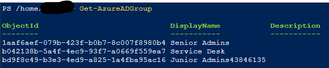
</figure>

9. Obtain a reference to the user account of Isabel Garcia: ```$user = Get-AzureADUser -Filter "UserPrincipalName eq 'Isabel@el1mkproton.onmicrosoft.com'"```
10. Add the user account of Isabel to the Junior Admins43846135 group: ```Add-AzADGroupMember -MemberUserPrincipalName $user.userPrincipalName -TargetGroupDisplayName "Junior Admins43846135"```
11. Verify that the Junior Admins43846135 group contains the user account of Isabel: ```Get-AzADGroupMember -GroupDisplayName "Junior Admins43846135"```

<figure>
  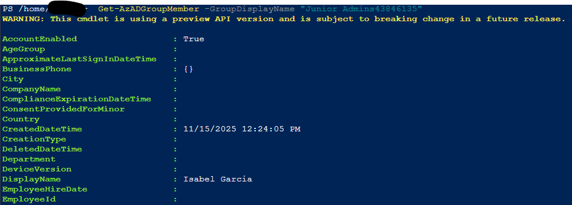
</figure>

# Exercise 3: Create a Service Desk group containing the user account of Dylan Williams as its member.

*Using Azure CLI*

1. Identify the name of my Microsoft Entra tenant: ```DOMAINNAME=$(az ad signed-in-user show --query 'userPrincipalName' | cut -d '@' -f 2 | sed 's/\"//')```
2. Create a user account for Dylan Williams: ```az ad user create --display-name "Dylan Williams" --password "Pa55w.rd1234" --user-principal-name Dylan@$DOMAINNAME```
3. List Microsoft Entra ID user accounts: ```az ad user list --output table```

<figure>
  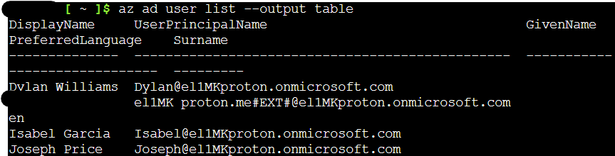
</figure>

4. Create a new security group named Service Desk: ```az ad group create --display-name "Service Desk" --mail-nickname "ServiceDesk"```
5. List the Microsoft Entra ID groups: ```az ad group list -o table```

<figure>
  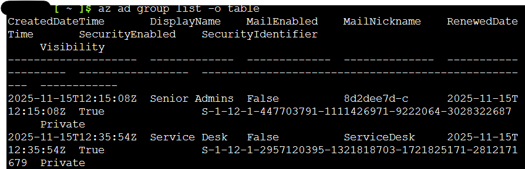
</figure>

6. Obtain a reference to the user account of Dylan Williams: ```USER=$(az ad user list --filter "displayname eq 'Dylan Williams'")```
7. Obtain the objectId property of the user account of Dylan Williams: ```OBJECTID=$(echo $USER | jq '.[].id' | tr -d '"')```
8. Add the user account of Dylan to the Service Desk group: ```az ad group member add --group "Service Desk" --member-id $OBJECTID```
9. List members of the Service Desk group: ```az ad group member list --group "Service Desk"```

<figure>
  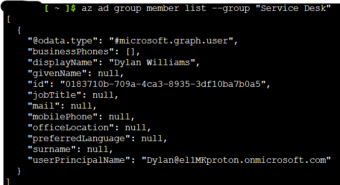
</figure>

# Exercise 4: Assign the Virtual Machine Contributor role to the Service Desk group.

1. Create a Resource Groups named AZ500Lab01.

<figure>
  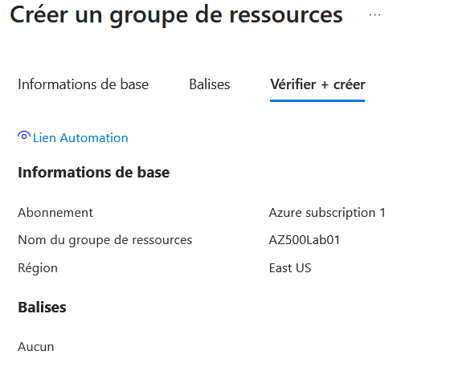
</figure>

<figure>
  
</figure>

2. Assign the role Virtual Machine Contributor for AZ500Lab01 to the Service Desk group.

<figure>
  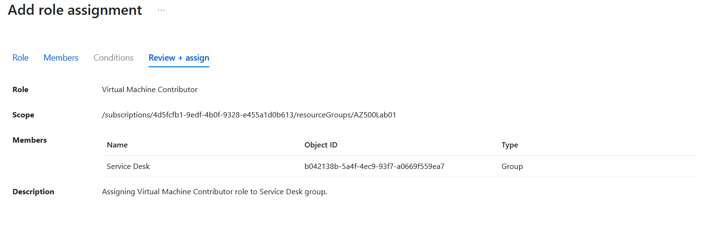
</figure>

3. Ensure Dylan has the access using RBAC.

<figure>
  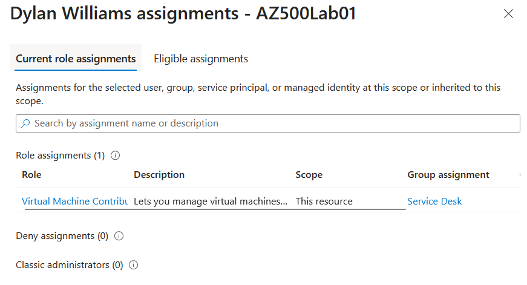
</figure>

# Bonus: Enforce MFA for a user

1. Enable MFA for user Joseph Price.

<figure>
  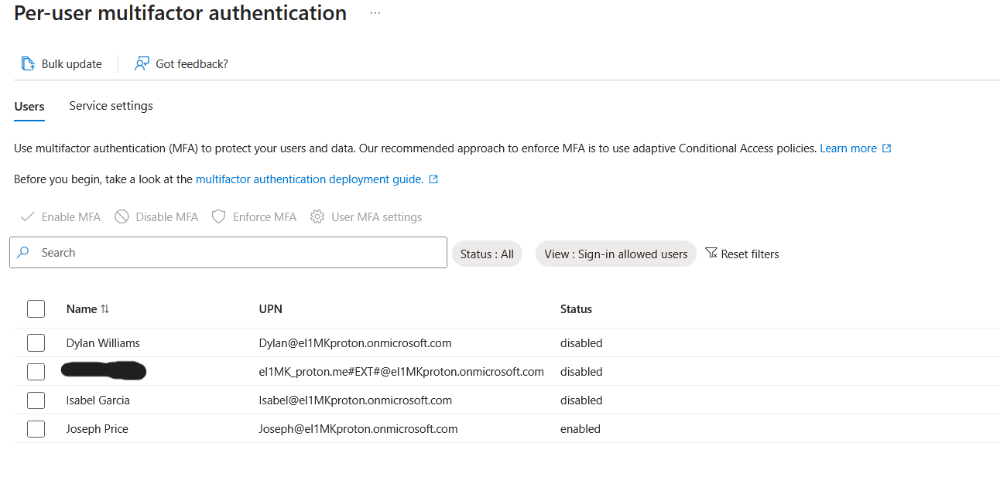
</figure>

2. Configure Microsoft Authenticator for Joseph Price.

<figure>
  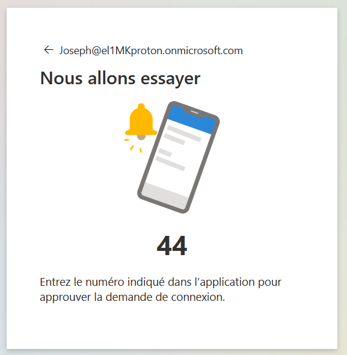
</figure>

<figure>
  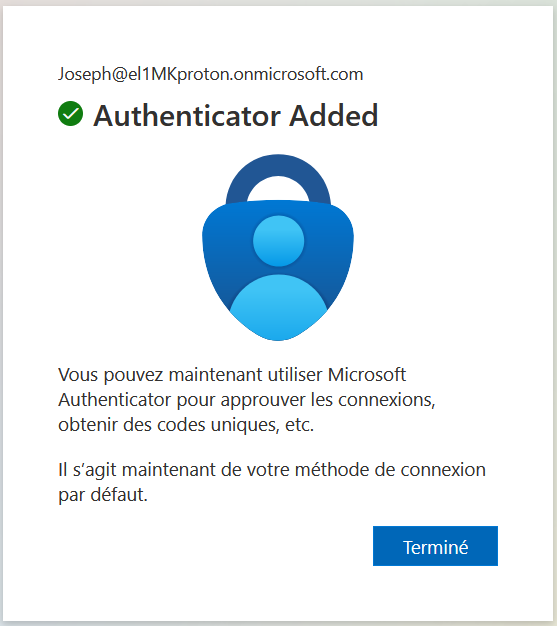
</figure>

3. Test signing-in as Joseph Price and ensure MFA enforcement.

<figure>
  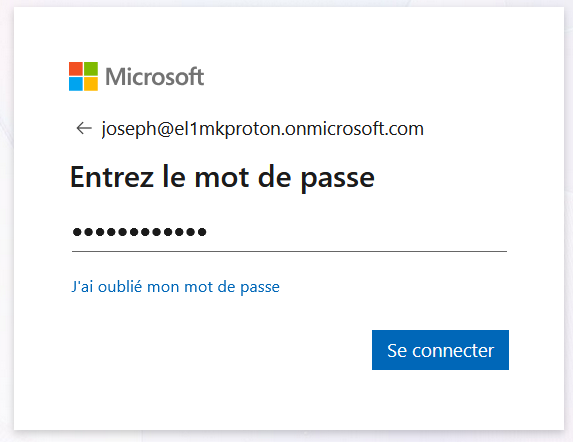
</figure>

<figure>
  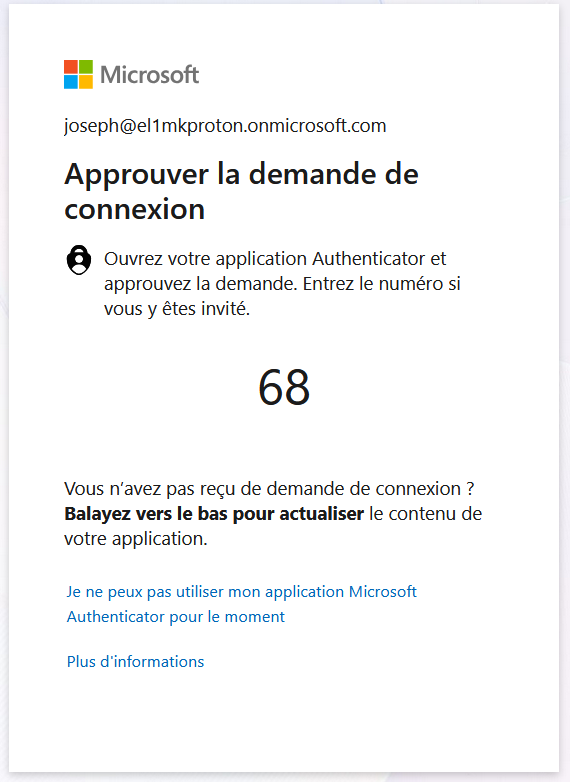
</figure>

   


